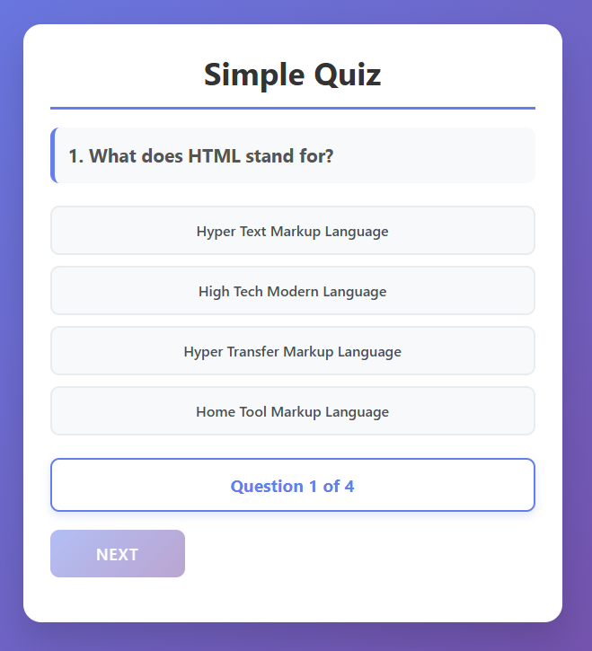
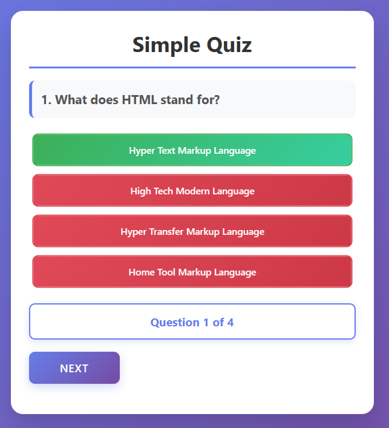
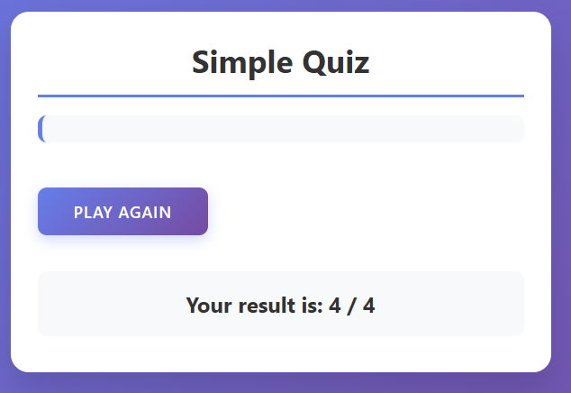

# 📝 Simple Quiz App

A clean and interactive quiz application built with HTML, CSS, and JavaScript.



*Main quiz interface with question and answers*

## 🚀 Live Demo
[View Live Demo](https://eskandr5.github.io/quiz-app)

## ✨ Features
- Multiple choice questions
- Instant feedback (correct/incorrect answers)
- Score tracking
- Progress indicator
- Responsive design
- Clean and modern UI

## 🖼️ Screenshots

<div align="center">
  
  <br>
  <em>Main quiz interface</em>
</div>

<br>

<div align="center">
  
  <br>
  <em>Visual feedback: correct (green) and incorrect (red) answers</em>
</div>

<br>

<div align="center">
  
  <br>
  <em>Final score display at the end of the quiz</em>
</div>

## 🛠️ Technologies Used
- HTML5
- CSS3 (Animations, Flexbox, Gradients)
- JavaScript (Vanilla)

## 📋 How to Use
- **Start Quiz**: Automatically begins with first question
- **Answer Selection**: Click on any answer button
- **Visual Feedback**:
  - ✅ Green for correct answers
  - ❌ Red for incorrect answers
- **Progress Tracking**: Shows current question number (e.g., "Question 1 of 4")
- **Score Display**: Shows final score at the end
- **Play Again**: Click "Play again" to restart the quiz

## 🎯 Quiz Topics
- HTML basics
- CSS styling
- JavaScript methods
- JavaScript variables

## 🔧 Installation

```bash
# Clone the repository
git clone https://github.com/eskandr5/quiz-app.git
# Open index.html in your browser
cd quiz-app
open index.html
```
## 👨‍💻 Author
Mohammad Eskandr

GitHub: @eskandr5

## 📝 License
This project is open source and available under the MIT License.
